<!-- **OS:**
<a href="https://www.archlinux.org">
<code></code>
</a>
<a href="https://www.gentoo.org">
<code></code>
</a> 
<a href="https://www.nixos.org">
<code></code>
</a>
<a href="https://www.microsoft.com/en-us/software-download/windows11">
<code></code>
</a> -->

<!--

-->

<!-- **DE:**
<a href="https://www.kde.org">
<code></code>
</a>
<a href="https://www.i3wm.org">
<code></code>
</a>

**Platforms:**
<a href="https://www.kernel.org">
<code></code>
</a>
<a href="https://www.microsoft.com/en-us/software-download/windows11">
<code></code>
</a>
<a href="https://www.termux.com">
<code></code>
</a>

**Languages:**
<a href="https://en.wikipedia.org/wiki/The_C_Programming_Language">
<code></code>
</a>
<a href="https://en.wikipedia.org/wiki/C%2B%2B">
<code></code>
</a>
<a href="https://www.python.org">
<code></code>
</a>
<a href="https://www.rust-lang.org">
<code></code>
</a>

**Hobby:**
<a>_History of China_、_Light Music_</a>

**Major:** _Computer Science_ -->
